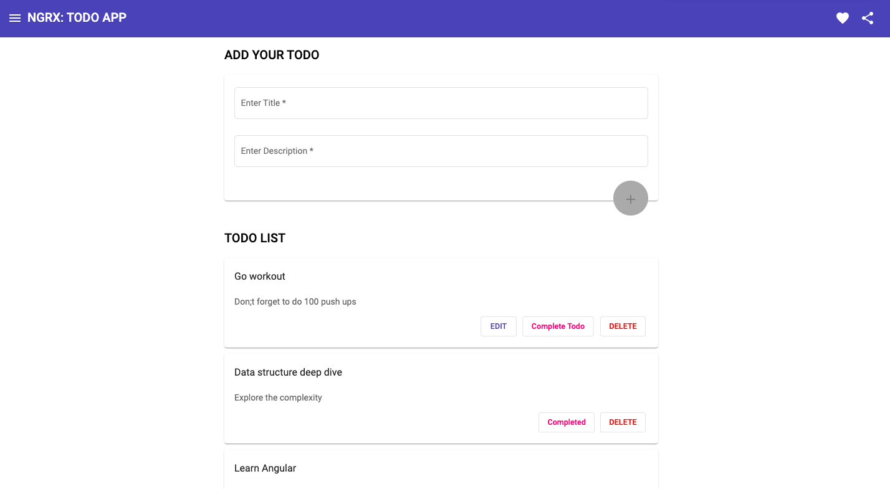

# AngularTodo

This project was generated with [Angular CLI](https://github.com/angular/angular-cli) version 10.0.4. 

## Development server

Run `ng serve` for a dev client side server. Navigate to `http://localhost:4200/`. The app will automatically reload if you change any of the source files.
To run mock node server run `node server.js` in seperate terminal

## Production Build Run 
Run `ng build` for a dev server and do npm start to run the both application on same server.
Navigate to `http://localhost:4000/`. 

